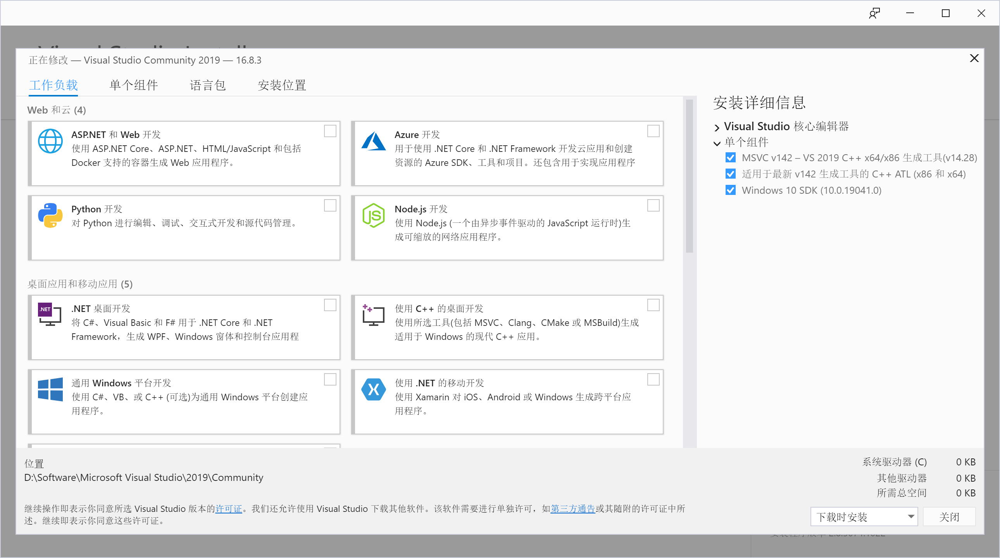
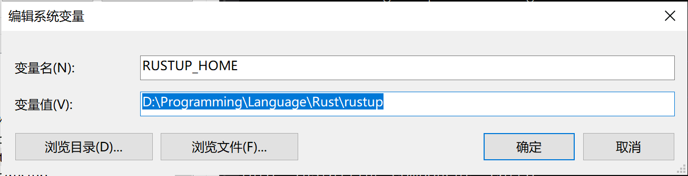
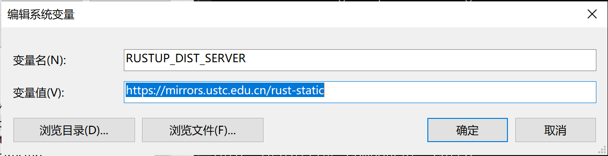
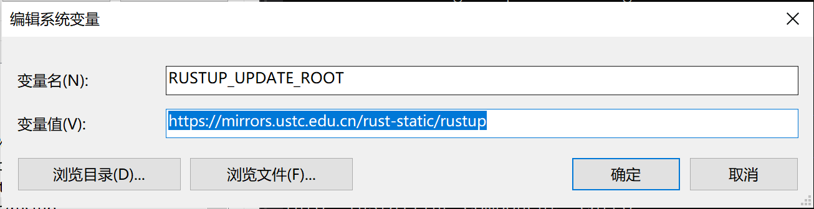
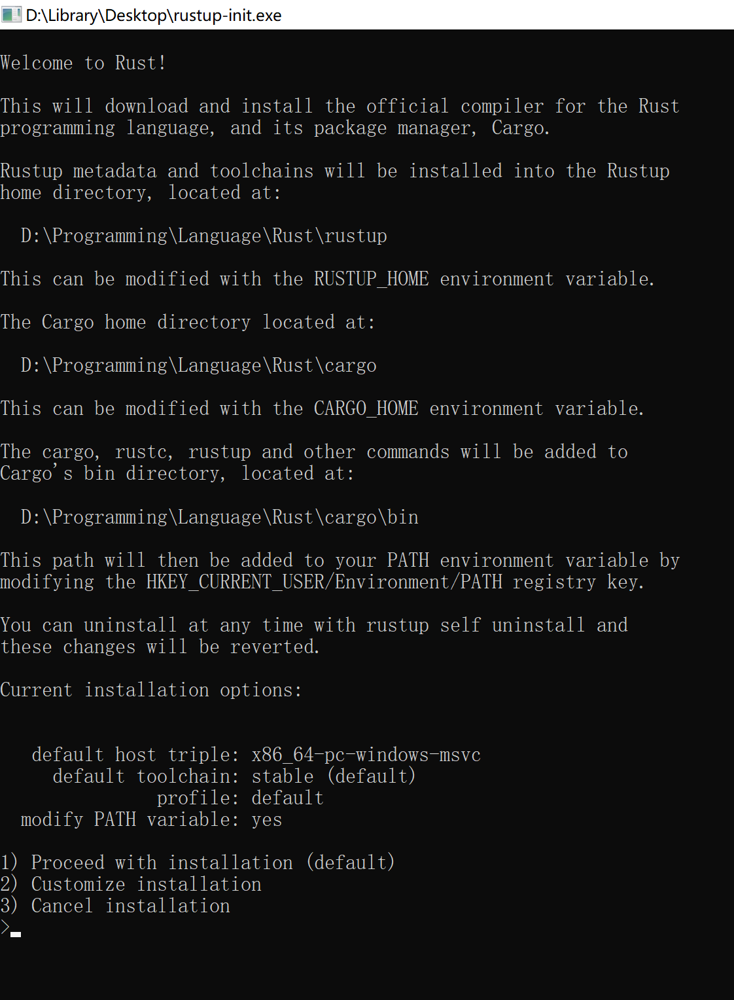
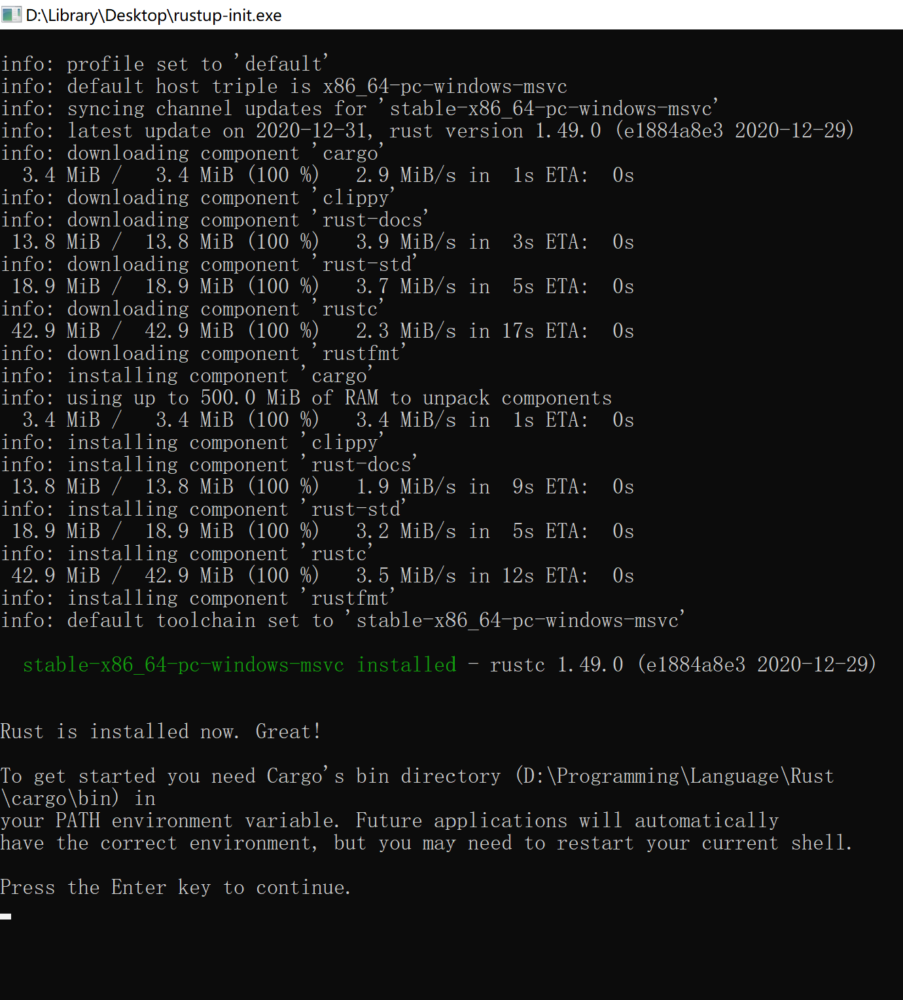
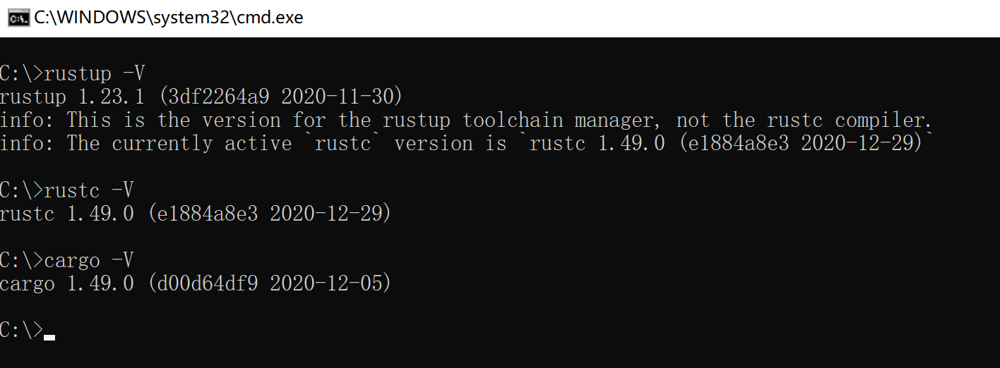
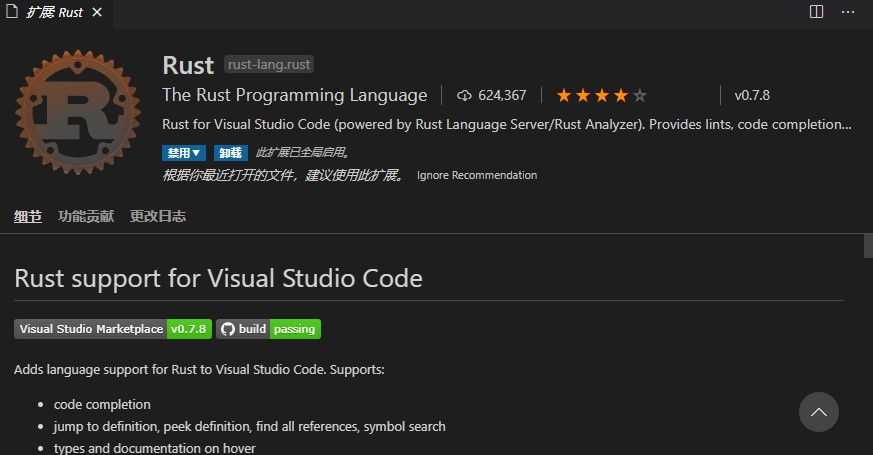
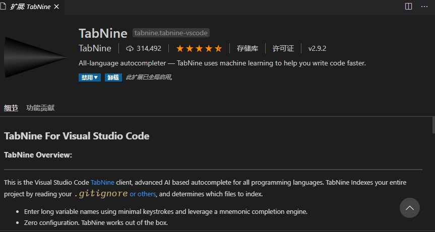
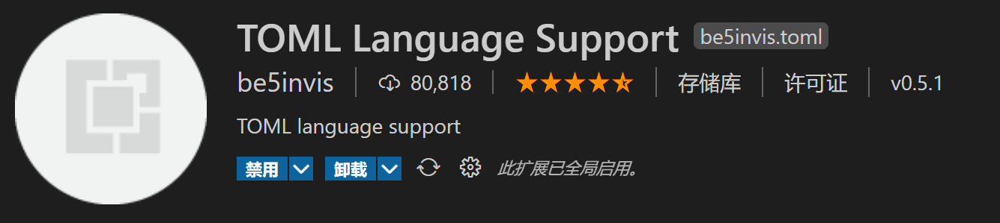

# Rust环境配置
## 安装C++build tool
### 安装VisualStudio
在单个组件选项卡中安装如下组件

## 安装Rust
**Rust** 中文官网 [Rust-lang](https://www.rust-lang.org/zh-CN) 下载 rustup-init.exe
### 配置环境变量
打开系统环境变量
在环境变量里新建 `RUSTUP_HOME` ，对应 **rustup** 的安装目录在环境变量里配置，以下是我的配置

新建`CARGO_HOME` ，对应 **cargo** 的安装目录

因为Rust的服务器在国外，安装速度较慢，所以我们可以考虑使用镜像源
新建 `RUSTUP_DIST_SERVER`，其中的内容为 `https://mirrors.ustc.edu.cn/rust-static`

新建 `RUSTUP_UPDATE_ROOT`，其中的内容为`https://mirrors.ustc.edu.cn/rust-static/rustup`

### 安装 Rust
运行 rustup-init.exe

输入 1 后回车即可

完成安装

### 验证安装

## 配置开发环境
### 安装编辑器
这里推荐[vscode](https://code.visualstudio.com/)，如果喜欢折腾的话也可以尝试一下最新的[Neovim](Rust/src/01/02.md)
### 安装插件
#### Rust官方插件

事实上官方的插件并没有社区的 [rust-analyzer](Rust/src/01/01.md)强大，所以更推荐使用社区的插件，而且社区插件将在不久后取代官方插件
#### 中文界面插件

#### AI代码提示插件

#### crate管理插件

#### TOML支持插件

## 至此rust环境配置完毕