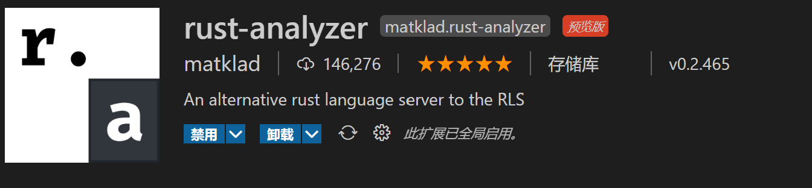

# rust-analyer

## 简介
rust-analyer(简称RA)是由Rust社区维护的RLS 2.0。RLS有的它更好，RLS没有的它还有，甚至可以提示第三方库的代码，所以更推荐安装这一个。更多内容可以浏览它官网的[用户手册](https://rust-analyzer.github.io/manual.html)
## 安装
安装插件之后，将会自动下载它服务器的二进制文件，点击下载即可

## 使用
对于一般的项目，确保vscode打开的是其根目录，即  **Cargo.toml** 所在的目录

对于大型项目，可以使用 **cargo workspace**，RA会检查根目录下的Cargo.toml文件，文件不像一般的cargo项目，在这里您需要指定workspace

在vscode中新建文件夹，在该文件夹下新建Cargo.toml文件，在文件内写入
```toml
[workspace]
members = []
```
如果要新建项目，现在该文件的members后的方括号内写入`"项目名"，` ，再在顶目录运行`cargo new 项目名`，新项目内将不会生成`Cargo.lock`文件和`targe`文件夹，而是与顶层目录共用这些文件，可以避免重复的编译

关于workspace，会在后续章节讲解